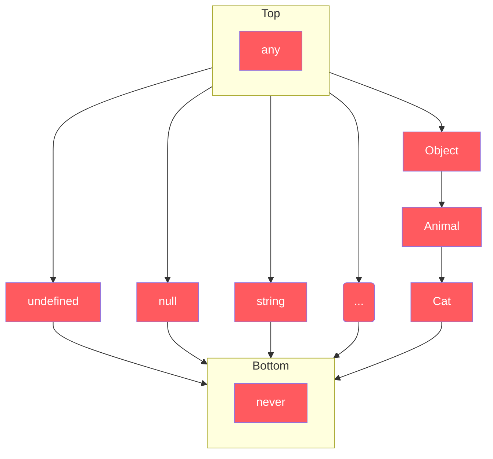

# Headings

## Heading 2

### Heading 3

#### Heading 4

# Text

*italic*

**bold**

*underline*

mark something as ==marked==

superscript^th^

subscript~2~0

Apple
:   Pomaceous fruit of plants of the genus Malus in the family Rosaceae.

---
---

# Highlight

> Block quote

```js
let code;
```

!!! help Admonition
    note | summary, abstract, tldr | info, todo | tip, hint | success, check, done | question, help, faq | warning, attention, caution | failure, fail, missing | danger, error, bug | example, snippet | quote, cite

<kbd>keyboard</kbd>

**red**{style="color:red"}

<font color="blue">blue</font>

# List

1. First item
1. Second item
1. Third item
    1. Indented item
    2. Indented item
1. Fourth item

[x] checked

[ ] unchecked

---

# Navigation

[Link](https://eff.org)

[[keyboard]]

# Table

|   column   | second |
|--------------|---------------|
|    *Italic*  | [x] **bold**      |
|    *Italic*  | [ ] **bold**      |

---

# Graph



---

# Definitions

*[HTML]: Hyper Text Markup Language
*[W3C]:  World Wide Web Consortium
The HTML specification is maintained by the W3C.
